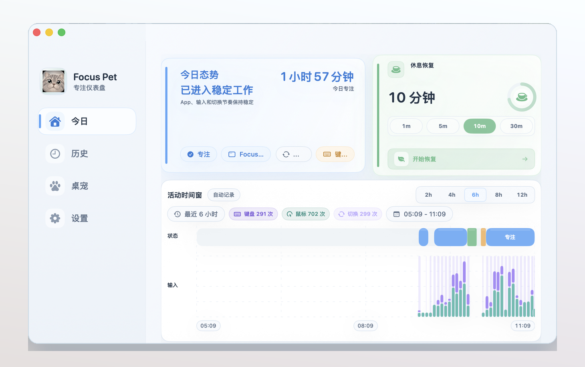
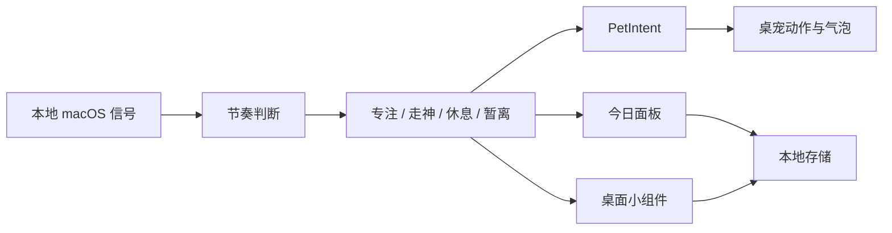

# Focus Pet

<p align="center">
  
</p>

<p align="center">
  <strong>让你的专注节奏长出一只会回应你的桌宠。</strong><br />
  Focus Pet 是一个本地优先的 macOS 专注伙伴：它把应用切换、输入节奏、休息和暂离整理成实时状态，再用桌宠、菜单栏和小组件温柔地提醒你。
</p>

<p align="center">
  
  
  
  
</p>

<p align="center">
  <a href="#为什么会让人动心">为什么会让人动心</a> ·
  <a href="#核心逻辑">核心逻辑</a> ·
  <a href="#界面预览">界面预览</a> ·
  <a href="#桌宠资源">桌宠资源</a>
</p>



## 为什么会让人动心

很多专注工具要求你不断填写任务、开始计时、复盘失败原因。Focus Pet 的出发点不同：它先观察你真实的工作节奏，再把这些原本看不见的状态变成一个可爱的、会回应你的桌面伙伴。

它不是又一个番茄钟，也不是一个冷冰冰的监控面板。

- 当你稳定工作时，它安静陪伴。
- 当你开始频繁切换或掉进娱乐内容时，它用气泡和动作轻轻拉你回来。
- 当你连续专注太久时，它建议休息，而不是继续压榨注意力。
- 当你离开又回来时，它把节奏接上，像桌面上有人记得你刚才在做什么。

Focus Pet 最有意思的地方，是把「状态识别」和「桌宠表达」分开：内部先判断你处在 `专注 / 走神 / 休息 / 暂离` 哪一种状态，再把状态转成 `PetIntent`，最后由每个桌宠资源包自己决定要播放哪个动作。于是不同宠物可以有完全不同的性格，但仍然理解同一套专注语义。

## 核心逻辑



Focus Pet 用的是一条很短、很克制的产品链路：

1. 读取本地信号：前台 App、bundle id、窗口标题分类、输入空闲、键盘鼠标活跃度、应用切换频率和手动专注/休息会话。
2. 稳定状态判断：用恢复阈值和冷却策略减少误判，不因为一次切换就立刻说你走神。
3. 生成桌宠意图：把工作、休息、走神、欢迎回来、拖拽、召回等语义交给 `PetIntent`。
4. 轻量表达：桌宠动作、气泡、菜单栏、今日面板和小组件都复用同一份状态，而不是各自解释一遍数据。

## 产品差异

| Focus Pet 做什么 | 为什么重要 |
| --- | --- |
| 本地优先 | 窗口标题、应用使用和输入节奏默认留在本机，不上传云端。 |
| 状态先于报表 | 用户先知道「我现在是什么节奏」，再决定要不要看复盘。 |
| 温柔提醒 | 走神、长专注、休息结束、欢迎回来都有独立冷却，避免通知轰炸。 |
| 桌宠语义层 | `PetIntent -> sourceAction` 映射让每个桌宠都有自己的动作性格。 |
| 隐藏复杂度 | 普通用户不需要管理规则；高级分类、阈值和权限检查收在设置里。 |
| macOS 原生 | 菜单栏、悬浮桌宠、SwiftUI dashboard、系统通知和桌面状态卡是一套连贯体验。 |

## 界面预览

### 今日面板

今日面板是 Focus Pet 的核心：当前状态、稳定时长、休息恢复、最近输入节奏和状态时间线都在第一屏里。它不是为了堆指标，而是让你一眼知道「我现在稳不稳」。


### 桌宠与动作映射

桌宠不是普通 GIF 播放器。Focus Pet 先产生语义意图，再由资源包映射到自己的动作。你可以让同一个「走神观察」在不同宠物身上表现成探头、发呆、拍桌或任何资源包支持的动作。


### 桌面小组件

小组件是扫读入口：不用打开 dashboard，也能看到当前状态和最近几小时的节奏分布。


## 一天里的 Focus Pet

- 上午进入稳定工作：桌宠安静待在角落，菜单栏显示当前状态。
- 中途频繁切换：状态进入走神观察，桌宠用短气泡提醒你回到任务。
- 连续专注太久：休息提醒出现，你可以从今日面板或桌宠旁边直接开始恢复。
- 午后回来：欢迎回来提醒接上节奏，今日面板继续累积输入与状态时间线。
- 晚上复盘：历史页把工作段、休息段、状态分布和应用使用压成可读记录。

## 功能亮点

- 四状态模型：`专注`、`走神`、`休息`、`暂离`。
- 本地状态识别：结合 App、窗口标题分类、输入空闲、活动量和应用切换。
- 专注与休息会话：支持手动专注任务、休息倒计时和自动休息提示。
- 桌宠表达：气泡、动作、拖拽、召回、跨屏移动和可调位置。
- 资源包系统：`pet.json` 描述动作、帧、音效、预览图和语义映射。
- 今日复盘：状态时间线、输入活动、窗口节奏、应用/类别分布。
- 桌面状态卡：当前状态卡和最近节奏卡，适合作为轻量常驻视图。
- 隐私设置：可暂停记录、隐藏原始标题、导出脱敏数据、清空本地数据。

## 桌宠资源

Focus Pet 保留每个资源包自己的动作命名，再把运行时语义映射过去。正式发行包不再内置占位桌宠；下面这些第三方资源只用于本地测试与资源包验证。

| 资源包 | 预览 | 说明 |
| --- | --- | --- |
| 罗小黑 |  | 来自 [jiang-taibai/IXiaoHei](https://github.com/jiang-taibai/IXiaoHei) 的本地转换资源。该上游未见明确 license，当前仅用于本地测试。 |
| 小呆 |  | 来源于 [ChaozhongLiu/DyberPet](https://github.com/ChaozhongLiu/DyberPet) 生态资源，原作者标注为 `栎曦_Nuo`。 |
| 像素猫 meme |  | 来源于 [ChaozhongLiu/DyberPet](https://github.com/ChaozhongLiu/DyberPet) 生态资源，原作者标注为 `代号皮克嗖儿`。 |

第三方素材的版权、角色 IP、音效和图片遵循各自上游项目与原作者授权。未确认再分发权的素材只作为本地测试资源使用。

## 隐私承诺

Focus Pet 的默认设计是本地优先：

- 默认不保存原始窗口标题。
- 可以只保存分类结果，也可以暂停所有本地记录。
- 统计、时间线和桌宠状态都来自本机数据。
- 支持导出脱敏统计和清空本地数据。

## 开发入口

```bash
swift build
swift run FocusPet
swift run FocusPetCoreChecks
```

主要模块：

- `FocusPetCore`：状态引擎、分类、提醒策略、设置和统计。
- `FocusPetRenderer`：桌宠窗口、气泡、动作展示和交互。
- `FocusPetWidgets`：桌面状态卡与 WidgetKit 快照视图。
- `FocusPetMac`：macOS app、菜单栏、系统监控和 dashboard。

## 许可证与致谢

项目代码许可证待补充。

感谢：

- [jiang-taibai/IXiaoHei](https://github.com/jiang-taibai/IXiaoHei)：罗小黑桌宠资源参考。
- [ChaozhongLiu/DyberPet](https://github.com/ChaozhongLiu/DyberPet)：小呆、像素猫 meme 等桌宠资源生态参考。
