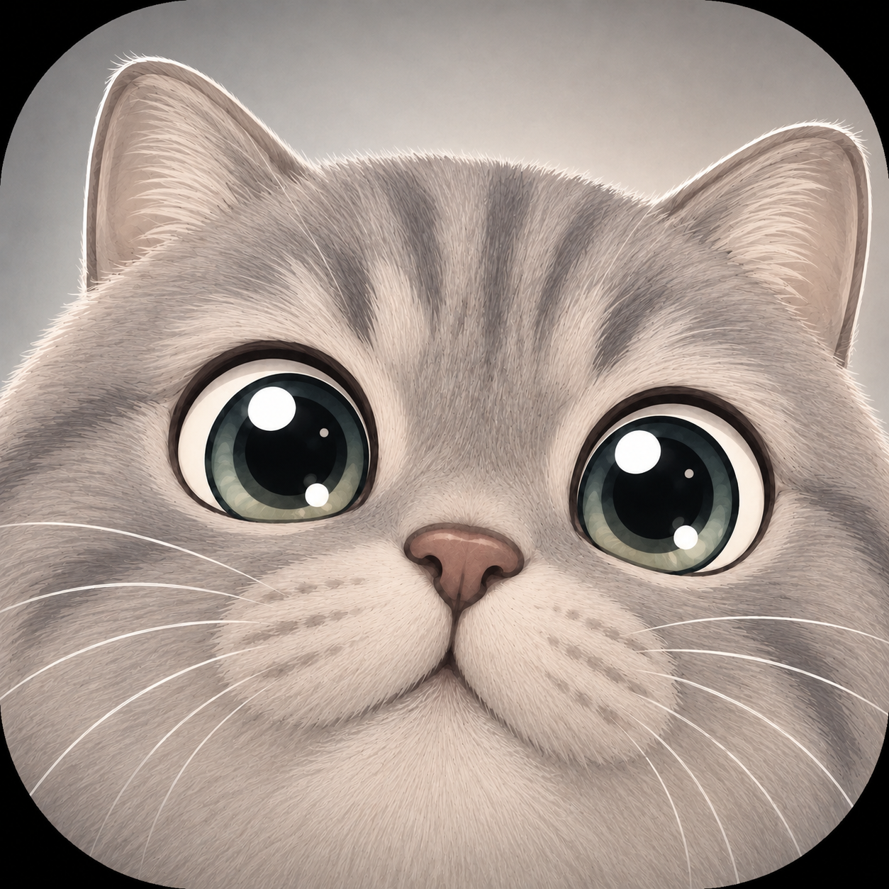
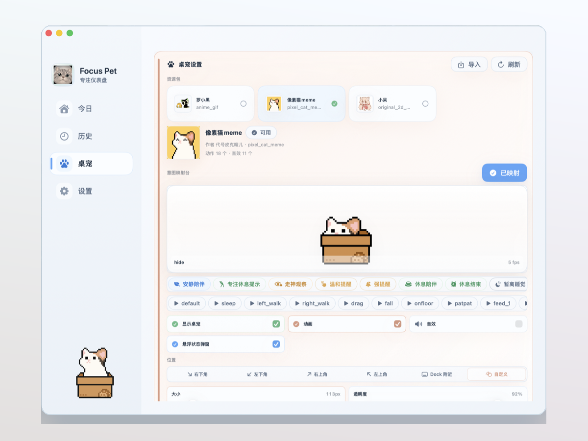
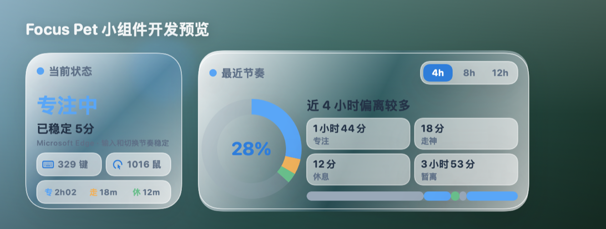
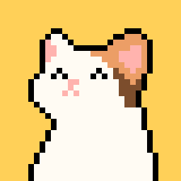
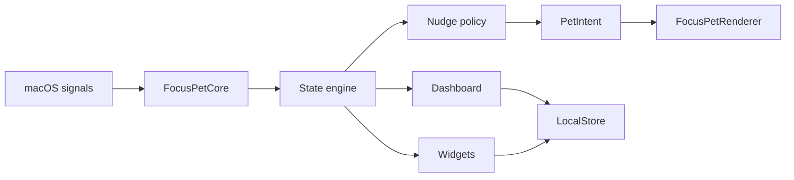

# Focus Pet

<p align="center">
  
</p>

<p align="center">
  <strong>一只住在 macOS 桌面的专注伙伴。</strong><br />
  本地识别工作节奏，用桌宠、菜单栏、提醒和小组件把「专注 / 走神 / 休息 / 暂离」变成可感知的状态。
</p>

<p align="center">
  
  
  
  
</p>

<p align="center">
  <a href="#功能亮点">功能亮点</a> ·
  <a href="#快速开始">快速开始</a> ·
  <a href="#桌宠资源">桌宠资源</a> ·
  <a href="#开发状态">开发状态</a>
</p>



## 这是什么

Focus Pet 是一个本地优先的 macOS productivity desktop pet。它不会把窗口标题、应用使用或输入活动上传到云端，而是在本机把这些信号整理成实时状态，再用一个轻量桌宠提醒你：继续保持、该休息了，或者该把注意力拉回来。

它不是一个单纯的 GIF 播放器。桌宠动作由 `PetIntent` 驱动：工作、走神、休息、回归、拖拽、召回、跨屏移动都可以映射到不同资源包自己的动作。

## 功能亮点

- 本地状态判断：结合前台 App、bundle id、窗口标题分类、空闲时间、应用切换频率和手动专注/休息会话。
- 四状态模型：`专注`、`走神`、`休息`、`暂离`，适合做日内复盘和轻量提醒。
- 桌宠提醒：通过气泡、动作和可配置提醒阈值表达状态，不把高级规则暴露给普通用户。
- macOS 原生体验：菜单栏入口、悬浮 `NSPanel` 桌宠、SwiftUI dashboard、系统通知和桌面小组件。
- 本地数据：JSON 存储、可导出、可清空，支持保留周期和脱敏导出。
- 资源包系统：`pet.json` 描述动作、帧、音效、预览图和语义映射，支持导入第三方桌宠资源。

## 界面预览

| Dashboard 与桌宠设置 | 桌面小组件 |
| --- | --- |
|  |  |

## 快速开始

### 运行开发版

```bash
swift build
swift run FocusPet
```

### 验证核心逻辑

```bash
swift test
swift run FocusPetCoreChecks
```

### 打包本地 App

```bash
./scripts/package-macos-app.sh
```

打包后的 app 会写入 `.build/FocusPet.app`。

本地 smoke DMG 可使用：

```bash
./scripts/package-dmg.sh --local
```

更完整的本地验证可使用 `scripts/build-verified-local-dmg.sh`。它会检查脚本语法、release build、DMG 布局、本地资源包和安装后启动路径。

## 下载与发布

Focus Pet 的发布包分两类：

- 本地 smoke 包：由 `--local` 生成，适合开发机验证安装、资源包和启动链路；通常是 ad-hoc 签名，不代表下载到其他 Mac 后一定能通过 Gatekeeper。
- 分发包：用于 GitHub Release 或公开下载，需要 Developer ID 签名、notarization 和 stapling，详见 [release packaging notes](docs/release-packaging.md)。

如果要上传稳定版 DMG，请优先使用分发包。没有 Developer ID 或 notary 凭据时，可以发布源码和说明，但不应把本地 smoke 包误标为已公证的正式安装包。

## 桌宠资源

Focus Pet 的资源包会把每个桌宠自己的动作命名保留下来，再映射到运行时的语义意图。当前本地测试资源包括：

| 资源包 | 预览 | 来源与状态 |
| --- | --- | --- |
| 罗小黑 |  | 来自 [jiang-taibai/IXiaoHei](https://github.com/jiang-taibai/IXiaoHei) 的本地转换资源。该上游未见明确 license，当前仅用于本地测试，不应随 release 再分发。 |
| 小呆 |  | 来源于 [ChaozhongLiu/DyberPet](https://github.com/ChaozhongLiu/DyberPet) 生态资源，原作者标注为 `栎曦_Nuo`；当前按本地资源包导入与验证。 |
| 像素猫 meme |  | 来源于 [ChaozhongLiu/DyberPet](https://github.com/ChaozhongLiu/DyberPet) 生态资源，原作者标注为 `代号皮克嗖儿`；当前按本地资源包导入与验证。 |

第三方素材默认放在 `external_generated_packs/`，distribution 打包流程默认不会把这些本地测试资源带入正式 release。导入、转换与映射规则见 [Luo Xiaohei notes](docs/luoxiaohei-local-pack.md) 和 `scripts/build-local-pet-packs.py`。

## Dashboard

当前 dashboard 有四个主入口：

- `今日`：当前状态、专注节奏、休息控制和输入活动概览。
- `历史`：专注会话、状态时间线和当天复盘。
- `桌宠`：资源包、动作映射、预览、位置、动画和音效。
- `设置`：隐私、提醒、判定参数、权限和本地数据。

## 架构



SwiftPM targets:

- `FocusPetCore`：状态引擎、分类、提醒策略、设置、统计和格式化。
- `FocusPetStorage`：本地 JSON 存储、导出、清空和保留策略。
- `FocusPetResources`：资源包 manifest、校验、fallback 和目录加载。
- `FocusPetRenderer`：桌宠 `NSPanel`、气泡、动作展示和交互。
- `FocusPetWidgets`：桌面小组件 snapshot 与 SwiftUI 视图。
- `FocusPetMac`：macOS app 入口、菜单栏、系统监控、dashboard 和权限入口。

## 隐私

Focus Pet 的默认设计是本地优先：

- 默认不保存原始窗口标题。
- 可只保存分类结果，或暂停所有本地记录。
- 可导出脱敏统计。
- 所有数据保存在用户本机的 Application Support 路径下。

## 开发状态

项目仍处于快速迭代阶段，当前重点是：

- 更稳定的 macOS 分发和跨机器安装验证。
- 更清爽的 dashboard 信息层级。
- 更可控的状态提醒和桌宠气泡体验。
- 更完善的资源包导入、预览和动作映射。
- 小组件与桌面状态的持续验证。

## 许可证与致谢

项目代码许可证待补充。第三方桌宠素材、角色 IP、音效与图片遵循各自上游项目和原作者的授权要求；未确认再分发权的素材仅用于本地测试。

感谢：

- [jiang-taibai/IXiaoHei](https://github.com/jiang-taibai/IXiaoHei)：罗小黑桌宠资源参考。
- [ChaozhongLiu/DyberPet](https://github.com/ChaozhongLiu/DyberPet)：小呆、像素猫 meme 等桌宠资源生态参考。
