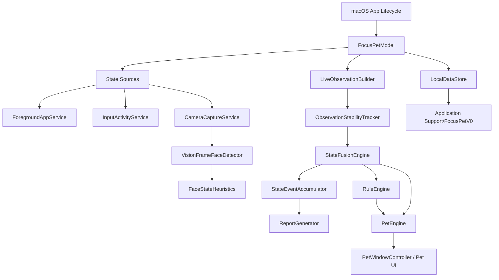
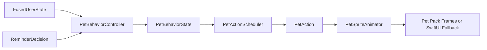

# Focus Pet 项目总结文档

更新日期：2026-06-10

## 1. 项目定位

Focus Pet 是一个本地运行的 macOS 专注桌宠原型。项目目标不是做一个强监控工具，而是用低打扰的方式在桌面上提供专注状态反馈：当用户在当前任务中保持活动时，桌宠安静陪伴；当检测到稳定的走神或暂离状态时，桌宠通过动画和气泡轻提醒；用户可以随时暂停检测、隐藏桌宠、导出或删除本地数据。

当前版本的核心边界如下：

- 运行平台：macOS 14+。
- 构建方式：SwiftPM，当前包含 `FocusPet` 和 `FocusPetCoreChecks` 两个 executable product。
- UI 技术：SwiftUI + AppKit。SwiftUI 负责主控制台、菜单内容和桌宠视图，AppKit 负责 `NSPanel` 浮动桌宠窗口、前台应用读取、摄像头采集、系统通知、窗口标题读取等 macOS 能力。
- 状态模型：只保留 `专注 focused`、`走神 distracted`、`暂离 away` 三种用户状态。
- 数据策略：本地 JSON 持久化，不保存视频或图片，不上传摄像头画面，不做人脸身份识别。
- 桌宠系统：支持默认占位桌宠、导入本地资源包、资源包校验、资源包选择、PNG 帧序列播放和动作兜底。

## 2. 产品功能总览

### 2.1 用户可见功能

当前应用提供以下主要体验：

- 菜单栏入口：展示当前状态，提供暂停/恢复检测、显示/隐藏桌宠、开启/关闭视觉辅助、打开控制台、进入桌宠设置和隐私面板。
- 主控制台窗口：包含 `今日`、`规则`、`桌宠`、`判断日志`、`隐私` 五个 Tab。
- 桌宠浮窗：一个无边框、透明背景、浮动层级的 `NSPanel`，可贴近 Dock、放到左右下角或手动拖拽定位。
- 桌宠交互：单击显示轻互动气泡，双击打开今日面板，拖拽调整位置，Hover 展示当前状态、置信度、前台应用、来源等信息。
- 低打扰提醒：进入稳定走神或暂离后，根据规则阈值和冷却时间显示桌宠气泡，必要时可走系统通知通道。
- 视觉辅助：用户开启后才请求摄像头权限，并使用 Apple Vision 在本机识别人脸框和头部姿态。
- 判断日志：以表格形式显示最近判断过程，包括帧、融合、是否有人脸、视线、俯仰角、置信度、融合状态和原因码。
- 隐私面板：展示视觉辅助状态、本地数据大小、本地记录数量、导出数据和删除数据入口。
- 桌宠资源包：可选择内置资源包或导入包含 `pet.json` 的本地资源包，界面展示来源、分发属性、授权提示和校验 warning/error。

### 2.2 当前默认行为

- 应用启动后创建主窗口、菜单栏入口和桌宠浮窗。
- 默认使用本地活动和前台应用判断；摄像头采样设置可持久化，未开启时不会采集视频帧。
- 状态循环每 10 秒推进一次。
- 本地快照默认至少间隔 180 秒持久化一次，退出时强制保存。
- 状态事件最多保留 720 条，提醒最多 80 条，判断日志最多 180 条。
- Demo 数据和 live 数据通过 `ObservationSourceKind` 区分，Demo 不计入真实日报指标，也不会触发现实提醒。

## 3. 代码结构

```text
Package.swift
README.md
scripts/
  package-macos-app.sh
  build-luoxiaohei-local-pack.py
docs/
  project-summary.md
  superpowers/plans/2026-06-10-pet-pack-system.md
Sources/
  FocusPet/
    FocusPetApp.swift
    AppDelegate.swift
    FocusPetModel.swift
    Services.swift
    StateSources.swift
    Views.swift
    DashboardTab.swift
    PetSettingsViews.swift
    PetArtViews.swift
    Pet/
      PetWindowController.swift
      PetDockAnchorController.swift
      PetInteractionView.swift
      PetHoverMenuController.swift
      PetBubbleController.swift
      PetEngine.swift
      PetResourceLoader.swift
      PetPackStore.swift
      PetPackImporter.swift
      PetSpriteAnimator.swift
    Resources/Pets/FocusDino/pet.json
  FocusPetCore/
    DomainModels.swift
    PetModels.swift
    StateFusionEngine.swift
    LiveObservationBuilder.swift
    FaceStateHeuristics.swift
    ObservationStabilityTracker.swift
    AppContextClassifier.swift
    RuleEngine.swift
    ReportGenerator.swift
    StateEventAccumulator.swift
    StateTimelineAnalyzer.swift
    DataRetention.swift
    FaceDiagnosticEntry.swift
    PetPack.swift
    PetPackValidator.swift
    Formatters.swift
  FocusPetCoreChecks/
    FocusPetCoreChecks.swift
Tests/
  FocusPetCoreTests/
    FocusPetCoreTests.swift
    PetPackTests.swift
```

### 3.1 Target 划分

`FocusPetCore` 是纯核心逻辑层，包含可测试的领域模型、状态融合、规则引擎、日报聚合、资源包协议和留存策略。它不依赖 SwiftUI、AppKit 或 AVFoundation，方便通过命令行校验。

`FocusPet` 是 macOS 应用层，负责 SwiftUI/AppKit UI、摄像头采集、前台应用读取、本地文件读写、桌宠浮窗和资源包导入。

`FocusPetCoreChecks` 是无 XCTest 依赖的核心逻辑回归检查入口。它通过普通 Swift executable 执行大量 `precondition`/自定义 `expect` 式校验，适合当前以 SwiftPM 为主的开发环境。

`FocusPetCoreTests` 是标准 test target，目前包含编译探针和资源包相关回归逻辑；考虑到本机工具链历史上对 `XCTest`/`Testing` 支持不稳定，`FocusPetCoreChecks` 仍是最稳定的核心验证入口。

## 4. 整体架构

### 4.1 分层设计



应用以 `FocusPetModel` 作为主状态容器。它是 `@MainActor` 的 `ObservableObject` 单例，承接 UI、服务层、核心算法和本地存储之间的协调。主窗口、菜单栏和桌宠浮窗都共享同一个 model，因此状态变化会实时反映在所有 UI 面。

### 4.2 生命周期

应用入口位于 `FocusPetApp.swift`：

- `WindowGroup("Focus Pet", id: "main")` 创建主控制台窗口。
- `MenuBarExtra` 创建菜单栏入口。
- 主窗口 `.task` 调用 `model.bootstrap()`，初始化摄像头权限、前台应用、日报、桌宠状态和摄像头采样。

`AppDelegate` 处理 AppKit 生命周期：

- `applicationDidFinishLaunching` 设置 regular activation policy，展示桌宠窗口，启动状态循环。
- `applicationWillTerminate` 停止状态循环并强制保存本地快照。

桌宠窗口由 `PetWindowController.shared.show(model:)` 创建，它使用 `NSPanel` 实现：

- `styleMask: [.borderless, .nonactivatingPanel]`
- 背景透明，`isOpaque = false`
- `level = .floating`
- `collectionBehavior = [.canJoinAllSpaces, .fullScreenAuxiliary]`
- 不随应用失焦隐藏，保持轻量桌面伴随体验。

## 5. 核心数据模型

### 5.1 用户状态

`UserState` 只暴露三态：

- `focused`：专注。
- `distracted`：走神。
- `away`：暂离。

历史版本中的 `resting`、`meeting` 会迁移为 `focused`；`possiblyDistracted`、`offScreen`、`lookingDown`、`entertainment`、`unknown` 会迁移为 `distracted`。这种 decoder 兼容保留了旧数据可读性，但不会把旧状态重新暴露给产品层。

### 5.2 观察输入

`StateObservation` 是状态融合前的统一输入，包含：

- 时间戳。
- 来源类型：`live` 或 `demo`。
- 人脸存在状态：`present`、`missing`、`unknown`。
- 视线状态：`screen`、`offScreen`、`down`、`side`、`unknown`。
- 头部俯仰角。
- 前台应用名。
- 上下文类型：办公、娱乐、会议、普通。
- 最近输入空闲时长。
- 当前观察稳定持续时间。
- 本地活动快照。

`LocalActivitySnapshot` 进一步拆出键盘、鼠标、滚动、前台应用稳定时长、窗口标题稳定时长、上次应用切换时长等信息。这样状态融合不只知道“是否有输入”，还知道输入类型和当前工作上下文是否稳定。

### 5.3 融合结果

`FusedUserState` 是融合后的最终状态，包含：

- `userState`
- `context`
- `confidence`
- `reason`
- `stableDurationSeconds`

`reason` 是项目中很重要的可解释性设计。UI 的判断日志、OSLog、回归检查都依赖这些原因码定位为什么某一刻被判断为专注、走神或暂离。

## 6. 状态识别实现细节

### 6.1 输入来源

当前 live 检测由三类本地信号组成：

1. 前台应用和窗口标题

`ForegroundAppService` 使用 `NSWorkspace.shared.frontmostApplication` 读取当前前台应用，再通过 `CGWindowListCopyWindowInfo` 查找同进程、layer 为 0 的窗口标题。窗口标题只在本机用于分类，不作为联网数据。

2. 本地输入活动

`InputActivityService` 使用 `CGEventSource.secondsSinceLastEventType` 分别读取键盘、鼠标、拖拽、滚动等输入距离当前的秒数。最终 `lastInputSeconds` 取键盘、鼠标、滚动中的最小值。

3. 可选摄像头视觉辅助

`CameraCaptureService` 使用 `AVCaptureSession`、`AVCaptureVideoDataOutput` 和 Apple Vision 做本机检测。设计点如下：

- `sessionPreset = .low`，降低资源消耗。
- 目标帧率配置为 2 fps。
- 检测间隔为 10 秒，避免每一帧都运行 Vision。
- 使用 `VNDetectFaceRectanglesRequest`，当前不做人脸身份识别。
- 没有检测到人脸时返回 `facePresence = .missing`。
- Vision 请求失败时返回 `unknown`，不会强行判定用户走神或暂离。

### 6.2 视觉启发式

`FaceStateHeuristics` 将 Vision 的人脸几何信息转换为产品可用的粗粒度状态：

- 无人脸：`facePresence = .missing`，`gazeState = .unknown`，原因 `no_face_detected`。
- 置信度低于 0.5：有人脸但视线未知，原因 `low_face_confidence`。
- yaw/pitch 缺失：有人脸但头部姿态不可用，原因 `head_pose_unavailable`。
- pitch 大于等于 24 度：`gazeState = .down`，原因 `pitch_over_threshold`。
- yaw 绝对值大于等于 24 度：`gazeState = .offScreen`，原因 `yaw_over_threshold`。
- 其余情况：`gazeState = .screen`，原因 `face_centered`。

这里的视觉算法刻意保持简单，只判断人脸是否存在和头部姿态是否大致看向屏幕。它不保存原始画面，也不做人脸身份或表情识别。

### 6.3 LiveObservationBuilder

`LiveObservationBuilder` 负责决定一条视觉检测结果是否可用于融合：

- 摄像头未授权或未运行时，返回 `camera_not_running` 的 unknown detection。
- 最近帧缺失或超过 20 秒，返回 `stale_or_missing_camera_frame`。
- 检测置信度低于 0.55，返回 `low_confidence_camera_ignored`。
- 只有在授权、运行、帧新鲜且置信度达标时，才把 `FaceDetectionResult` 写入 `StateObservation`。

这层设计避免了摄像头刚启动、权限未授予、低置信度和旧帧导致错误判断。

### 6.4 稳定性跟踪

`ObservationStabilityTracker` 会根据以下字段生成稳定性 key：

- 来源类型。
- 人脸存在状态。
- 视线状态。
- 上下文类型。
- 本地活动分层。

本地活动分层分为：

- active：30 秒内有输入。
- recentlyActive：30 到 60 秒。
- idle：60 到 180 秒。
- longIdle：180 秒以上。

当 key 变化时，稳定起点重置。融合引擎因此可以表达“离屏超过 8 秒”“娱乐上下文超过 30 秒”“无人脸且无输入超过 45 秒”等稳定条件，而不是被单次噪声直接触发。

### 6.5 状态融合规则

`StateFusionEngine` 的规则有明确优先级。核心设计是：确认看向屏幕优先视为专注，娱乐上下文或本地空闲只有在未确认屏幕凝视且稳定达到阈值后才转为走神或暂离。

主要规则如下：

| 条件 | 状态 | 置信度 | 原因 |
| --- | --- | --- | --- |
| 无人脸、无近期输入、稳定超过 45 秒 | 暂离 | 0.80 | `face_missing_sustained` |
| 有人脸且看向屏幕 | 专注 | 0.90 | `gaze_on_screen`, `face_present` |
| 娱乐上下文稳定超过 30 秒 | 走神 | 0.86 | `front_app_is_entertainment`, `entertainment_context_over_30s` |
| 有人脸且离屏稳定超过 8 秒 | 走神 | 0.84 | `gaze_off_screen_over_threshold`, `face_present` |
| 有人脸且低头或 pitch >= 28，稳定超过 12 秒 | 走神 | 0.84 | `head_down_over_threshold`, `face_present` |
| 有人脸且侧脸稳定超过 8 秒 | 走神 | 0.80 | `side_head_over_threshold`, `face_present` |
| 会议上下文、视觉未知、无输入超过 10 分钟 | 暂离 | 0.68 | `meeting_idle_over_10m`, `local_input_idle` |
| 会议上下文、短时间无输入但前台稳定 | 专注 | 0.74 | `meeting_context_without_input`, `stable_front_app` |
| 工作上下文、近期键盘输入、前台稳定 | 专注 | 0.82 | `work_keyboard_activity`, `stable_front_app` |
| 工作上下文、近期本地输入 | 专注 | 0.76 | `work_recent_activity`, `local_input_active` |
| 非会议、视觉未知、无输入超过 180 秒 | 暂离 | 0.70 | `local_input_idle_over_180s` |
| 非会议、无输入超过 60 秒 | 走神 | 0.66 | `local_idle_over_60s` |
| 普通上下文、近期输入 | 专注 | 0.68 | `recent_local_activity`, `neutral_context` |
| 视觉未确认但 30 秒内有输入 | 专注 | 0.68 | `recent_input`, `vision_unconfirmed` |
| 无输入超过 60 秒且未确认看屏幕 | 走神 | 0.62 | `input_idle_without_confirmed_screen_gaze` |
| 以上都不满足 | 专注 | 0.58 | `default_to_focused_until_distraction_stable` |

这套优先级解决了一个关键产品问题：如果 Vision 已经确认用户看向屏幕，即使前台应用被分类为娱乐，也先判为专注。只有没有确认屏幕凝视时，娱乐上下文才会在稳定 30 秒后变成走神。

## 7. 前台应用上下文分类

`AppContextClassifier` 是本地规则打分器，不依赖网络模型。它使用应用名、bundle id 和窗口标题做匹配，并输出详细分数：

- 工作：Cursor、Visual Studio Code、Xcode、Terminal、iTerm、Obsidian、Notion、Word、Preview 等。
- 娱乐：YouTube、Bilibili、Netflix、Steam 等。
- 会议：Zoom、Teams、Google Meet、腾讯会议、VooV Meeting 等。
- 普通：没有命中时默认 neutral。

匹配策略：

- bundle id 命中：0.86。
- 窗口标题命中：0.88。
- 应用文本命中：0.72。
- 没有命中时 neutral：0.45。

分类结果会写入 `AppContextClassification`，包含 context、confidence、各类 score 和 reason，例如 `bundle_match:com.microsoft.vscode`、`title_match:youtube`、`no_app_context_match`。

## 8. 提醒规则设计

`RuleEngine` 只负责“什么时候提醒”，不负责“用户是什么状态”。它基于融合结果、规则配置和冷却时间输出 `ReminderDecision`。

规则触发条件：

- 检测没有暂停。
- 来源必须是 `live`，Demo 不触发真实提醒。
- 融合状态置信度必须大于等于 0.65。
- 规则启用。
- 当前上下文命中规则上下文集合。
- 当前状态命中规则状态集合。
- 稳定持续时间达到规则等待阈值。
- 同一规则未处于冷却期。

默认规则：

| 规则 | 上下文 | 状态 | 等待 | 冷却 | 动作 |
| --- | --- | --- | --- | --- | --- |
| 走神提醒 | work / neutral / meeting | distracted | 20 秒 | 300 秒 | 桌宠气泡 |
| 娱乐走神提醒 | entertainment | distracted | 60 秒 | 900 秒 | 桌宠气泡 |
| 暂离过久提醒 | 全上下文 | away | 180 秒 | 900 秒 | 桌宠气泡 |

规则页提供 `安静`、`平衡`、`积极` 三档预设，只调整等待和冷却参数，不修改底层识别逻辑。

## 9. 事件、日报和图表

### 9.1 状态事件累积

`StateEventAccumulator` 将每次融合结果写成连续事件：

- 默认 tick 时长为 10 秒。
- 同一来源、同一状态、同一上下文，且距离上一事件不超过 15 秒时合并。
- 事件总数超过 720 条时保留最新 720 条。
- 置信度为 0 的状态不会写入事件。

这种设计适合采样式状态检测：即使每 10 秒才推进一次，也能形成连续的时间线。

### 9.2 日报聚合

`ReportGenerator` 基于 `StateTimelineAnalyzer` 生成 `DailySummary`：

- 只统计当天、source 为 `live` 的事件。
- Demo 事件单独计数，不进入真实专注/走神/暂离指标。
- 合并间隔小于等于 12 秒的同状态片段。
- 统计总活动秒数、专注秒数、走神秒数、暂离次数、最长连续专注、提醒次数、桌宠能量。
- 桌宠能量默认按专注分钟换算，范围限制在 0 到 99。

今日页将日报展示为三个核心指标：

- 有效专注。
- 走神时长。
- 暂离次数。

并通过最近 4 小时折线图和占比环形图展示状态节奏。

## 10. 桌宠系统

### 10.1 行为链路

桌宠行为从融合状态和提醒结果推导：



行为映射：

- 用户从暂离回到非暂离：`welcomeBack`。
- 娱乐上下文走神或娱乐提醒：`nudgeEntertainment`。
- 普通走神：`nudgeDistracted`。
- 专注：`sleeping`，保持安静陪伴。
- 暂离：`sleeping`。
- Hover：临时 `observing`，动作切到 `stretch`。
- 拖拽中：`dragged`。
- 拖拽结束：`landing`，短暂播放落地动作。

`PetActionScheduler` 做动作节流：

- sleeping 下初始为 `sleep`，之后每 18 秒在 `blink`、`stretch`、`shortWalk` 中轮换。
- nudge 类动作有 300 秒冷却，避免频繁打扰。
- 拖拽、落地、欢迎回来等动作直接映射。

### 10.2 气泡设计

`PetBubbleController` 根据状态和提醒生成气泡：

- 单击桌宠：轻互动气泡，例如“我在这里，不打扰你。”
- 普通走神：`distracted` 气泡，主按钮“回到任务”。
- 娱乐走神：`entertainment` 气泡，主按钮“继续 10 分钟”，次按钮“回到工作”。
- 暂离回来：`welcomeBack` 气泡，按钮“继续”“今天状态”。

气泡显示在独立 `NSPanel` 中，使用 `PetBubblePanelController` 跟随桌宠位置，并自动做屏幕边界约束。

### 10.3 浮窗定位

`PetDockAnchorController` 支持四种位置：

- `dockAttached`：贴近 Dock 所在边。
- `bottomRightCorner`：右下角。
- `bottomLeftCorner`：左下角。
- `manual`：用户拖拽后的自定义位置。

拖拽结束时会自动解析落点：

- 靠近 Dock：吸附回 Dock 上方或侧边。
- 靠近左下角/右下角：吸附到对应角落。
- 其他位置：进入手动模式并持久化 `manualOrigin`。

桌宠尺寸限制在 96 到 160 px，透明度限制在 0.5 到 1.0。

## 11. 桌宠资源包系统

### 11.1 Manifest 协议

资源包以文件夹为单位，必须包含 `pet.json`。核心结构由 `PetPack` 定义：

```json
{
  "schemaVersion": 1,
  "id": "focus_dino",
  "name": "Focus Dino",
  "source": "bundled",
  "distribution": "redistributable",
  "style": "system_placeholder",
  "license": {
    "type": "original",
    "note": "Created for Focus Pet."
  },
  "defaultSize": {"width": 128, "height": 128},
  "defaultScale": 1.0,
  "anchor": "dockAttached",
  "hitBox": {"x": 12, "y": 12, "width": 104, "height": 104},
  "actionAliases": {
    "walkLeft": "walkRight",
    "dragged": "idle",
    "landing": "welcomeBack"
  },
  "animations": {
    "sleeping": {"folder": "sleeping", "fps": 4, "loop": true},
    "idle": {"folder": "idle", "fps": 1, "loop": true}
  }
}
```

标准动作键：

- `sleeping`
- `idle`
- `blink`
- `stretch`
- `walkLeft`
- `walkRight`
- `nudgeDistracted`
- `nudgeEntertainment`
- `welcomeBack`
- `dragged`
- `landing`

兼容扩展动作：

- `shakeHead`
- `idleSpecial`
- `playfulIdle`

同时支持部分旧 key 映射，例如 `sleep` -> `sleeping`、`walk_left` -> `walkLeft`、`nudge_distracted` -> `nudgeDistracted`。

### 11.2 动画解析和兜底

`PetSpriteCatalog.frames(for:)` 和 `PetPack.animationKey(for:)` 都遵循同一套兜底顺序：

1. 目标动作。
2. `actionAliases` 中声明的动作。
3. `idle`。
4. `sleeping`。
5. 第一个可用动画。
6. SwiftUI 默认 `PetFigureView`。

当前内置 `FocusDino` manifest 是系统占位资源包，仓库内没有真实 PNG 帧目录时会走 SwiftUI fallback。这个 fallback 使用纯 SwiftUI 绘制桌宠形象，并根据三态显示不同表情和配件。

### 11.3 资源包校验

`PetPackValidator` 校验内容：

- 是否存在 `pet.json`。
- manifest 是否可读。
- `id` 是否符合 `^[A-Za-z0-9_-]+$`。
- animations 是否为空。
- default size 是否在 64 到 512 之间。
- fps 是否在 1 到 60 之间。
- 是否存在 `preview.png`。
- license 是否 unknown。
- distribution 是否 unknown。
- 是否缺失 idle/sleeping。
- 动画目录是否存在。
- 动画目录是否有 PNG 帧。
- 单动画帧数是否超过 240。
- 是否至少有一个可播放动画。

校验分为 error 和 warning。warning 不阻止导入，error 会阻止导入。

### 11.4 导入和安装

`PetPackImporter` 的导入策略：

- 用户选择本地包含 `pet.json` 的文件夹。
- 先用 `PetPackValidator` 校验。
- 校验无 error 后，将资源包复制到 `~/Library/Application Support/FocusPetV0/PetPacks/{petId}/`。
- 将 manifest 中的 `source` 改写为 `userImported`。
- 后续运行只读取 Application Support 中的安装副本，不再依赖用户原始目录。

`PetPackStore` 合并三类记录：

- bundled records：应用 bundle 内 `Resources/Pets`。
- user records：Application Support 中导入的资源包。
- generated records：开发期生成的本地测试包。

同 id 资源包会做去重，后出现的记录优先。

### 11.5 罗小黑本地测试包边界

`scripts/build-luoxiaohei-local-pack.py` 用于把本地 `external_assets/IXiaoHei/src/org/taibai/hellohei/img` 中的 GIF/PNG 转成 `external_generated_packs/LuoXiaoHeiLocal` 资源包。

脚本行为：

- 缺少源目录时明确报错。
- 清理并重建输出目录。
- 将 GIF 拆成 RGBA PNG 序列。
- 生成 `preview.png`。
- 生成 `pet.json`，id 为 `luo_xiaohei_local`，distribution 为 `localOnly`，license type 为 `unknown`。
- 映射动作包括 idle、nudgeDistracted、nudgeEntertainment、welcomeBack、stretch、idleSpecial、playfulIdle。

边界说明：

- `external_assets/` 和 `external_generated_packs/` 已在 `.gitignore` 中忽略。
- 该资源包是本地测试资源，不应当当作可再分发内置美术。
- 当前打包脚本如果发现 `external_generated_packs/LuoXiaoHeiLocal`，会复制到 `.app` 的 `Contents/Resources/LocalPetPacks/LuoXiaoHeiLocal` 供本地运行使用，同时默认清理 raw `external_assets` 和 `external_generated_packs` 目录。

## 12. 本地数据与隐私

### 12.1 持久化路径

`LocalDataStore` 将数据保存在：

```text
~/Library/Application Support/FocusPetV0/
```

主要文件：

- `settings.json`：应用设置。
- `rules.json`：提醒规则。
- `reminders.json`：提醒历史。
- `state-events.json`：状态事件。
- `face-diagnostics.json`：判断日志。
- `focus-pet-export-{timestamp}.json`：导出快照。
- `PetPacks/{petId}/`：用户导入的桌宠资源包。

### 12.2 AppSettings

`AppSettings` 持久化内容包括：

- onboarding 是否完成。
- 是否暂停检测。
- 定时暂停截止时间。
- 桌宠透明度、比例、尺寸。
- 桌宠是否隐藏、隐藏截止时间。
- 桌宠位置模式和手动坐标。
- Hover 菜单开关。
- 摄像头采样开关。
- 声音开关。
- 当前选择的桌宠资源包 id。

decoder 提供旧数据兼容：缺失字段会回落到默认值，旧 `runtimeMode` 会在下次保存时被移除。

### 12.3 留存策略

`DataRetentionPolicy` 默认策略：

| 数据 | 数量上限 | 时间上限 |
| --- | --- | --- |
| 状态事件 | 720 条 | 14 天 |
| 提醒历史 | 80 条 | 30 天 |
| 判断日志 | 180 条 | 6 小时 |

启动时会执行一次回收，周期保存前也会回收。导出快照最多保留 5 个，超过 7 天的旧导出会被清理。

### 12.4 隐私承诺

产品层明确展示以下承诺：

- 画面只在本机处理。
- 不保存视频或图片。
- 不上传摄像头画面。
- 不做人脸身份识别。
- 可随时暂停检测。
- 可一键删除数据。

摄像头关闭、权限未授予或采样暂停时，状态识别会退回本地输入和前台应用判断。暂停检测会停止 camera session，并且不会继续写入状态事件。

## 13. 判断日志与可观测性

`FaceDiagnosticEntry` 是可观测性的核心结构，记录两类阶段：

- `frame`：摄像头帧进入系统时的人脸/视线信息。
- `fusion`：状态融合后的最终判断信息。

字段包括：

- 时间戳。
- 阶段。
- 帧序号。
- 人脸状态。
- 视线状态。
- 头部俯仰角。
- 视觉/融合置信度。
- 融合状态。
- 上下文。
- 稳定持续时长。
- 原因码。
- 前台应用名和窗口标题。
- 本地活动快照。
- 上下文分类置信度和原因。

`FocusPetModel.appendFaceDiagnostic` 做了两层控制：

- 内存上限：最多保留 180 条。
- 重复去重：18 秒内完全相似的诊断不重复追加。

此外，诊断会以 30 秒间隔写入 OSLog，subsystem 为 `local.focuspet.v0`，category 为 `FaceDiagnostics`，便于在 Console 中排查视觉和融合问题。

## 14. UI 设计细节

### 14.1 主控制台

主窗口最小尺寸为 920 x 640。整体使用 SwiftUI TabView，页面结构稳定、信息密度较高，避免把工具做成营销页。

`今日` Tab：

- 顶部 hero header 展示当前状态、暂停/继续、显示/隐藏桌宠、进入桌宠设置。
- 当前状态面板展示前台应用、上下文、本地活动、判断来源。
- 三个指标卡展示有效专注、走神时长、暂离次数。
- 最近状态概览展示 4 小时折线和时间占比。

`规则` Tab：

- 展示状态判断流程。
- 用三张状态卡解释专注、走神、暂离的本地规则。
- 提供提醒规则编辑器和三档预设。

`桌宠` Tab：

- 左侧预览当前桌宠、状态、行为和气泡。
- 右侧配置资源包、位置、动画、Hover 信息、提醒声音、透明度和尺寸。
- 显示资源包来源、分发属性、授权和校验提示。

`判断日志` Tab：

- 顶部展示来源、本地输入、应用稳定性和当前状态。
- 表格展示最近 90 条诊断记录。
- 行内容压缩但保留关键调试字段。

`隐私` Tab：

- 展示视觉辅助状态、最新帧、暂停状态、当前状态。
- 提供开启/关闭采集、请求权限、打开辅助功能设置。
- 展示本地数据大小、状态/提醒/日志数量、导出和删除入口。

### 14.2 Onboarding

首次进入时展示本地运行和隐私边界：

- 摄像头只用于本地状态识别。
- 默认不保存视频或图片。
- 不做人脸身份识别。
- 可以随时暂停和删除本地数据。

用户可以直接进入原型，也可以先请求摄像头权限。

### 14.3 桌宠窗口

桌宠窗口本身不抢焦点，保持浮动但轻量。交互设计：

- 单击：切换 blink/stretch 并显示轻互动气泡。
- 双击：打开今日状态。
- Hover：显示 Hover 信息面板。
- 拖拽：进入 dragged 动作，结束后解析吸附或手动位置。
- 右键菜单：暂停/继续、隐藏 30 分钟、回到 Dock、放到右下角、设置、退出。

Hover 面板展示：

- 当前资源包名。
- 当前状态。
- 桌宠行为。
- 判断来源。
- 前台应用。
- 状态置信度。
- 最近提醒消息。

## 15. 构建、运行和打包

### 15.1 构建

```bash
swift build
```

### 15.2 核心校验

```bash
swift run FocusPetCoreChecks
```

该命令覆盖核心状态融合、旧状态迁移、规则触发、Demo 隔离、日报聚合、事件合并、稳定性跟踪、应用分类、数据留存、判断日志字段、视觉启发式、LiveObservation 过滤和资源包兜底。

### 15.3 打包成本地 `.app`

```bash
./scripts/package-macos-app.sh
open .build/FocusPet.app
```

打包脚本行为：

- 先执行 `swift build`。
- 创建 `.build/FocusPet.app`。
- 复制 `.build/debug/FocusPet` 到 `Contents/MacOS/FocusPet`。
- 复制 SwiftPM resource bundle 到 `Contents/Resources`。
- 写入 `Info.plist`。
- 设置 `CFBundleIdentifier = local.focuspet.v0`。
- 写入 `NSCameraUsageDescription`，用于触发 macOS 摄像头权限说明。
- 如果存在本地生成的罗小黑测试包，则复制到 app resource 下的 `LocalPetPacks`。

## 16. 测试覆盖

### 16.1 FocusPetCoreChecks 覆盖点

当前命令式检查覆盖以下风险点：

- 用户状态只暴露三态。
- 看向屏幕一定优先判专注。
- 未确认视觉但近期工作输入判专注。
- 离屏、低头、娱乐上下文进入走神。
- 工作键盘活动高置信专注。
- 工作空闲进入可触发规则的走神。
- 会议短时无输入仍保持专注。
- 会议超长无输入进入暂离。
- 会议场景下确认离屏仍进入走神。
- 中性上下文鼠标活动保持较低置信专注。
- 短暂无人脸但近期输入不直接暂离。
- 持续无人脸进入暂离。
- 长空闲且视觉未知进入暂离。
- 旧状态 decoder 迁移。
- 旧 settings 默认值迁移。
- 桌宠行为映射。
- nudge 五分钟冷却。
- 资源包别名和兜底。
- manifest 旧 key 解码。
- 资源包校验 error/warning。
- 规则触发、冷却、Demo 忽略、暂停忽略。
- 日报聚合和采样片段合并。
- 事件累积合并。
- 稳定性跟踪忽略前台应用噪声。
- 应用分类读取浏览器标题。
- 数据留存回收。
- 判断日志字段保存。
- 视觉启发式。
- LiveObservation 使用、忽略过期和低置信检测。

### 16.2 Tests 目录

`Tests/FocusPetCoreTests` 当前更像 SwiftPM test target 的编译和回归探针：

- `FocusPetCoreTests.swift` 验证事件累积、日报合并、Demo 规则隔离、会议超长空闲等核心行为。
- `PetPackTests.swift` 验证资源包别名、idle/sleeping/first animation 兜底、缺 manifest 拒绝、warning-only playable pack 允许导入。

## 17. 当前实现限制

1. 视觉算法仍是粗粒度启发式

当前只使用 Vision 的人脸框和头部 yaw/pitch/roll 信息，不做真正的眼动追踪。因此 `screen/offScreen/down` 是姿态级别估计，不应被理解为精确视线追踪。

2. 前台应用分类依赖规则表

应用和窗口标题分类是本地规则匹配，没有机器学习模型。新应用、新浏览器标题、新语言场景需要扩充规则。

3. 辅助功能权限影响窗口标题质量

窗口标题读取依赖 macOS 可访问的窗口信息。若系统权限不足，仍可获取前台应用，但标题级别分类可能弱化。

4. 默认内置资源包是占位协议

`FocusDino` 当前提供 manifest 作为内置协议样例；没有对应 PNG 帧时，运行时使用 SwiftUI 绘制 fallback。真实美术包可以通过导入或本地生成方式接入。

5. 声音开关已持久化但提醒主通道仍是气泡

当前产品的低打扰实现以桌宠气泡和系统通知为主，`soundEnabled` 已作为设置保留，后续可以接入更明确的音效策略。

6. 标准 XCTest 不是主要验证路径

仓库有 test target，但当前最可靠的本地回归入口仍是 `swift run FocusPetCoreChecks`。

## 18. 后续建议

### 18.1 识别质量

- 增加更细的摄像头状态解释，例如权限、session、最近帧年龄、置信度过滤原因的分区展示。
- 为前台应用分类提供可编辑规则列表，让用户自行标注某些 app/网站属于工作、娱乐或会议。
- 为视觉阈值增加实验配置入口，但默认仍保持保守。

### 18.2 桌宠体验

- 为资源包引入 preview 动画预览，而不只是当前动作预览。
- 补齐 FocusDino 的真实 PNG 序列，减少 fallback 依赖。
- 增加资源包导入后的“测试动作”面板，逐个播放 sleeping、idle、nudge、welcomeBack 等动作。
- 将 `soundEnabled` 接到明确的短音效资源，并提供静音时段。

### 18.3 数据和报告

- 增加按天查看历史日报。
- 增加“本次专注段”而不是只看今日聚合。
- 增加导出 JSON schema 文档，方便后续可视化或迁移。
- 在删除数据前提供更明确的确认和删除范围说明。

### 18.4 工程质量

- 如果后续安装完整 Xcode，可恢复并扩展标准 XCTest。
- 将 UI 中较长的 `Views.swift` 继续按 Tab 拆分，降低维护成本。
- 对 AppKit 服务增加协议抽象，方便模拟摄像头、前台应用和输入事件。
- 对资源包打包边界增加自动检查，避免 local-only 测试资源误进入可发布包。

## 19. 总结

Focus Pet 当前已经从单纯原型扩展为一个具备完整本地闭环的 macOS 专注桌宠应用：它有明确的三态模型、可解释的状态融合、低打扰提醒、日报聚合、判断日志、本地数据留存和可导入的桌宠资源包系统。实现上，项目把纯逻辑放在 `FocusPetCore`，把 macOS 能力和 UI 放在 `FocusPet`，再用 `FocusPetCoreChecks` 保证核心行为可回归验证。

这个架构的关键价值在于可解释和可控：用户能看到为什么被判定为某种状态，能关闭视觉辅助，能暂停检测，能删除数据，也能替换桌宠资源。后续迭代应继续保持这个方向，把识别精度、资源包体验和历史报告做深，而不是引入不可解释的重型监控逻辑。
